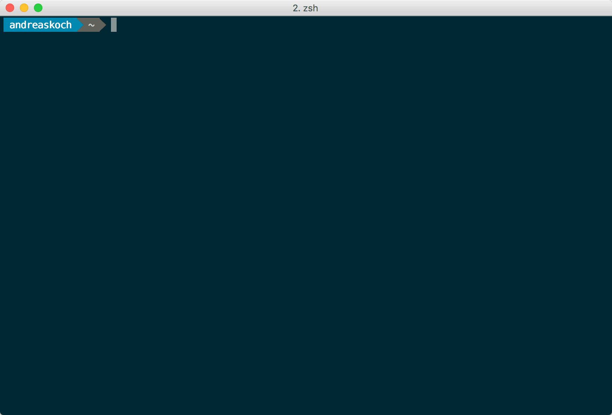

# 「 gargantua 」

The fast website crawler

You can use「 gargantua 」to quickly and easily

- **warm-up** your frontend caches
- perform small **load-tests** against your publicly available pages
- **measure** response times
- **detect** broken links

from your command line on Linux, macOS and Windows.



> Note: Press `Q` to stop the current crawling process.

## Usage

Crawl **www.sitemaps.org** with 5 concurrent workers:

```bash
gargantua crawl --url https://www.sitemaps.org/sitemap.xml --workers 5
```

see also: [A short introduction video of gargantua on YouTube](https://www.youtube.com/watch?v=TSCMvUvc0qo)

## Download

You can download binaries for Linux, macOS and Windows from [github.com »andreaskoch » gargantua » releases](https://github.com/andreaskoch/gargantua/releases):

```bash
wget https://github.com/andreaskoch/gargantua/releases/download/v0.2.0-alpha/gargantua_linux_amd64
```

## Docker Image

There is also a docker image that you can use to download or run the latest version of gargantua:

[andreaskoch/gargantua](https://hub.docker.com/r/andreaskoch/gargantua/)

```bash
docker run --rm andreaskoch/gargantua:latest \
       crawl \
       --verbose \
       --url https://www.sitemaps.org/sitemap.xml \
       --workers 5
```

**Note**: You will need the `--verbose` flag in order to prevent the command-line UI from loading. Otherwise gargantua will fail.

## Roadmap

- Increase the number of workers at runtime
- Personalized user agent string
- Silent mode (only show statistics at the end)
- CSV mode (print CSV output to stdout)
- Web-UI
- Save downloaded data to disk

## License

「 gargantua 」is licensed under the Apache License, Version 2.0. See [LICENSE](LICENSE) for the full license text.
